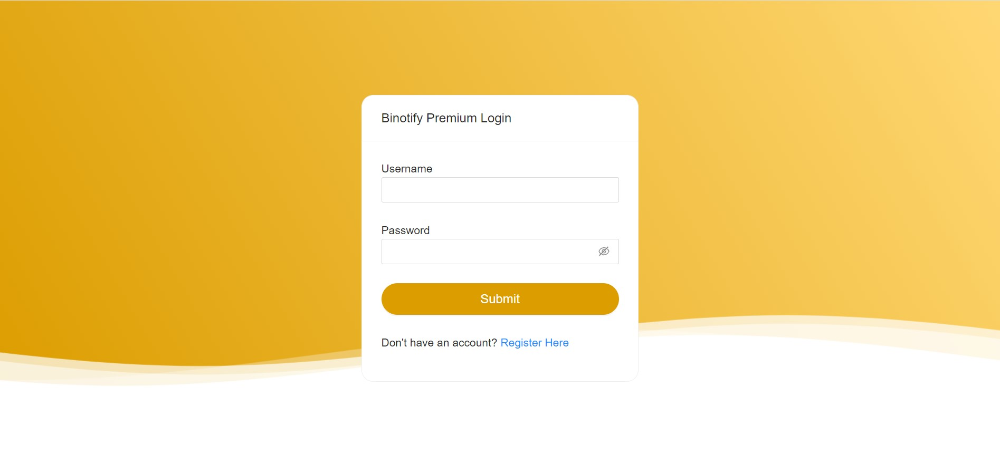
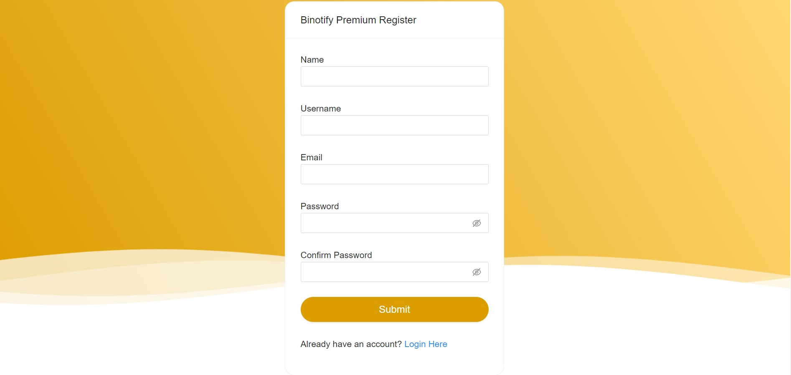
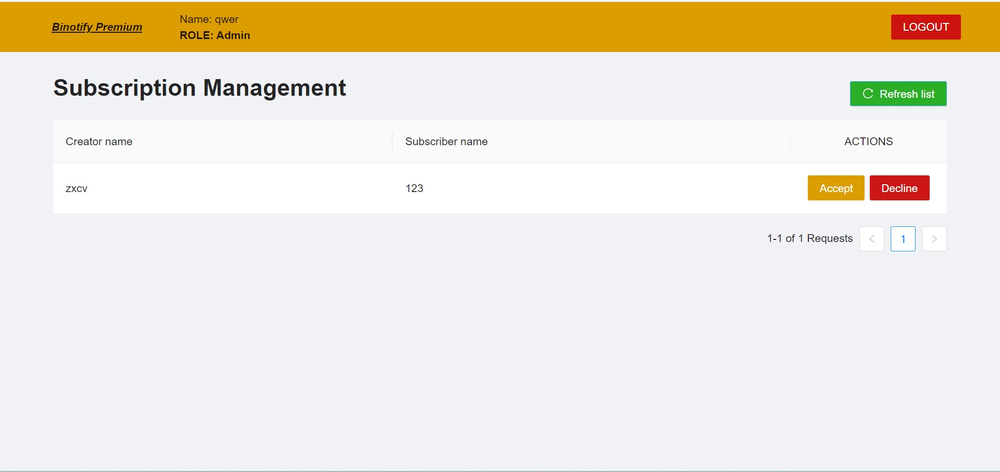
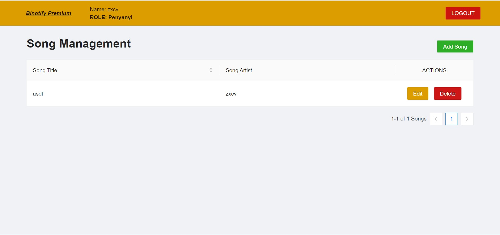

# Kelompok 2 WBD

## Deskripsi aplikasi web

Web ini merupakan aplikasi web manajemen lagu dari subscription dari binotify app Terdapat 4 halaman pada web ini yaitu:

1. LoginPage: Halaman untuk melakukan autentikasi ke dalam web.
2. RegisterPage: Halaman untuk melakukan pendaftaran akun pada basis data.
3. SubscriptionPage: Halaman untuk mengelola list subscription.
4. SongsPage: Halamn untuk mengelola list lagu yang dimiliki oleh penyanyi.

## Daftar requirement

1. node.js
2. npm/yarn

## Cara instalasi

1. Instalasi node.js(npm sudah termasuk) terdapat pada situs https://nodejs.org/en/download/
2. Instalasi yarn (tidak wajib) dapat dilakukan dengan command `npm install -g yarn`

## Cara menjalankan

1. Clone repo ini.
2. Masuk ke direktori repo.
3. Jalankan command `npm install` atau `yarn install` untuk menginstall semua dependency.
4. Jalankan command `npm start` atau `yarn start` untuk menjalankan aplikasi web.
5. Buka browser dan ketikkan `localhost:____` pada url untuk mengakses aplikasi web (\_\_\_\_ diisi sesuai dengan yang ditampilkan pada console).

## Screenshot tampilan aplikasi

1. Login
    
2. Register
    
3. Subscription Management Page
    
4. Song Management Page
    

## Detail Pembagian tugas

Desain: 13520136, 13520093
Implementasi: 13520093, 13520093
Testing: 13520064
